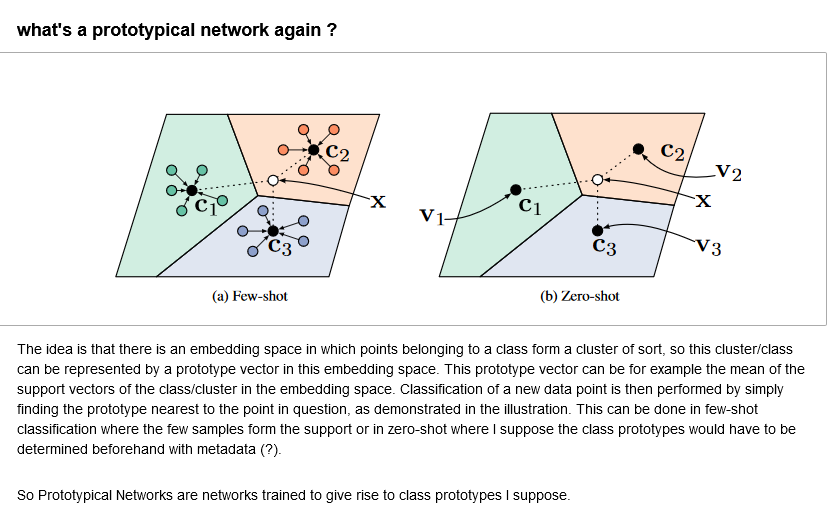
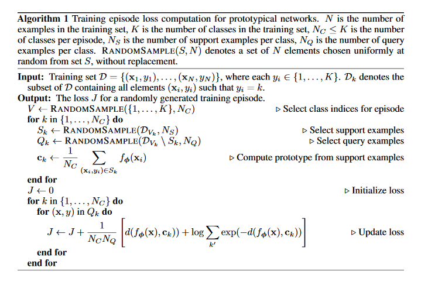

# kaggle_herbarium_2020

code for Kaggle herbarium 2020 competition

# Data
The training data 

# Code

# Prototype Networks
The approach is based on prototype networks

The algorithm, from the paper introducing Prototype Networks reads:

# some reflection
So the approach works ok for th. The issue is that there are 32k classes to predict on - which means for storing 32k prototype vectors and for each sample, 32k distances to said prototype vectors.  
