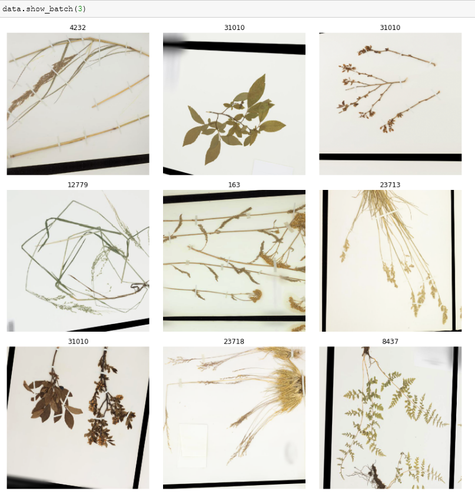

# kaggle_herbarium_2020

code for Kaggle herbarium 2020 competition, built with PyTorch

# Data
(from the competition page)
"The Herbarium 2020 dataset contains over 1M images representing over 32,000 plant species. This is a dataset with a long tail; there are a minimum of 3 specimens per species. However, some species are represented by more than a hundred specimens. This dataset only contains vascular land plants which includes lycophytes, ferns, gymnosperms, and flowering plants. The extinct forms of lycophytes are the major component of coal deposits, ferns are indicators of ecosystem health, gymnosperms provide major habitats for animals, and flowering plants provide all of our crops, vegetables, and fruits."

A sample of random leafs is below:

# Code
There are 3 main notebooks:
* prototype networks - pretrain: pretrain a model as a vanilla classifier on a set of most populated classes. This is basically to get the model ready for the actual problem.
* prototype networks - train: train the prototype network
* prototype networks - inference: prediction on test set.

# Prototype Networks
The approach is based on prototype networks, the idea of which is roughly as follows

The algorithm, from the paper introducing Prototype Networks reads:

# some reflection
So the approach works ok for the most part. The issue is that there are 32k classes to predict on - which means computing and storing 32k prototype vectors and for each sample, 32k distances to said prototype vectors. So both training and prediction become quite expensive. For prediction, I sidestep the issue somewhat by predicting on batches of classes then aggregate towards the end - it's not fast but works for lesser GPUs, certainly less than those I was competing against.

I also wonder if we can also improve robustness of the prototypes, considering some classes are significantly scarce but because of GPU limitation, I couldn't experiment too much on this.
